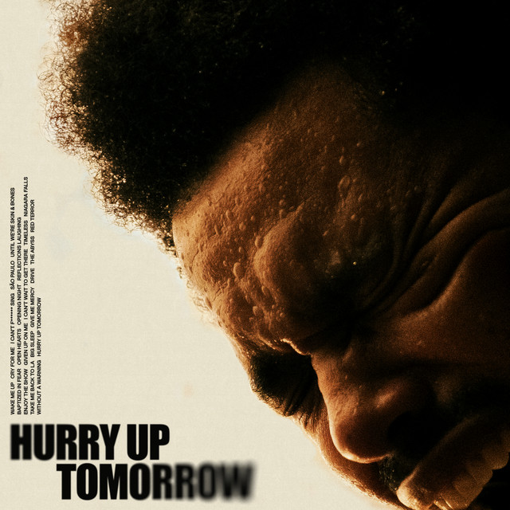

<!-- Profile README Revamped: Clean layout, fixed broken markup, professional & visually engaging -->
<div align="center">

# 🚀 Ahmad Hassan —Software Engineer


<!-- Typing animation -->


<!-- Badges -->
[](https://github.com/Ahmadhassan30)
[](https://github.com/Ahmadhassan30?tab=followers)
[](https://linkedin.com/in/your-linkedin)
[](https://your-portfolio.com)
[](https://leetcode.com/u/Ahmad_Hassan31/)

</div>

---

<!-- Reworked About section layout for better orientation -->
## 👋 About Me

<table>
<tr>
<td valign="top" width="58%">
I'm that rare breed of developer who can both make pretty buttons for websites AND create AI that might eventually replace me. Full stack engineer by day, AI whisperer by night — building web apps that humans love and AI agents that occasionally listen to me.

- Turning caffeine into code since before it was cool to talk to your AI assistant
- Crafting web experiences that work (yes, even in IE... kidding, I have standards)
- Engineering AI agents that follow instructions better than my roommate's cat
- Building RAG systems so powerful they can find that one Stack Overflow post you bookmarked but lost
- Translating business requirements into technical solutions and AI hallucinations into actual features
</td>
<td valign="top" width="42%">
<p align="center"></p>
</td>
</tr>
</table>

<details>
<summary><b>Tech Snapshot (click to expand)</b></summary>

```javascript
const ahmad = {
  pronouns: ["he", "him"],
  domains: ["Agentic AI", "LLMs", "RAG", "Knowledge Graphs", "AI Systems"],
  stacks: {
    frameworks: ["LangChain", "LlamaIndex", "LangGraph", "CrewAI"],
    models: ["GPT-4", "Claude", "Llama", "Mistral"],
    vectorDBs: ["Pinecone", "Weaviate", "Chroma", "FAISS"],
    backend: ["FastAPI", "Node.js", "Django"],
    frontend: ["Next.js", "React", "Tailwind"],
    devops: ["AWS", "Docker", "Kubernetes", "GitHub Actions"]
  },
  philosophy: "AI augments human imagination — narrative context is a reasoning substrate.",
  currentFocus: "Architecting resilient multi-agent reasoning loops",
  fun: ["Literary analysis with LLMs", "Recursive cognition", "Book-driven embeddings"]
};
```
</details>

---

## 🎯 Strategic Focus (2025)
- 🤖 Scaling autonomous multi-agent architectures (coordination + memory + reflection)
- 🧠 Researching emergent alignment behaviors in instruction-tuned LLMs
- 📚 Encoding literary theory into retrieval + reasoning pipelines
- 🌐 Hybrid retrieval: knowledge graphs + dense embeddings + structured tool outputs
- 🛠️ Contributing to open-source agentic orchestration frameworks
- ✍️ Publishing insight pieces on narrative-informed AI reasoning

---

## 📚 Literary AI Perspective
> *"Where symbolic pattern meets human metaphor, intelligence becomes narrative."*

- 📖 Literature as training signal: stories = temporal causal compression
- 🔍 Structural parallels: motifs ≈ latent clusters, foreshadowing ≈ long-horizon dependencies
- 🧬 Narrative scaffolding improves multi-step reasoning coherence
- 🧠 Future: Agents that build and revise internal story-worlds while acting

### Currently Reading
- **Philosophy** - Exploring consciousness, ethics, and the mind-body problem
-  **Fiction** - Literary works that challenge perception and reality

---

## 🛠️ AI & Tech Arsenal
<div align="center">

### Core AI & ML


<!-- Fixed broken badge: removed extra space after logo=and ensured URL encoding -->


### Agentic & GenAI


### Retrieval & Memory


### Full Stack & Infra


### DevOps


</div>

---

## 📊 Analytics & Metrics
<div align="center">
  
  
  
</div>

---


## 🔝 Top Contributed Repositories

<p align="center">
  
</p>

---

## 🎵 Currently Vibing
<div align="center">
  <a href="https://open.spotify.com/track/0sTBOp1hdayTjw6UOyPyi6?si=227ff81c736a47a5" target="_blank" rel="noopener noreferrer">
    
  </a>
  <p><strong>Open Heart</strong> — The Weeknd</p>
</div>

---


## ⚡ Personality Snapshot
- 🤖 AI emergent behavior explorer
- 📚 Reads >200 books/year (thematic analysis + embedding experiments)
- ✍️ Experiments with symbolic + neural narrative synthesis
- ☕ Coffee-powered deep work cycles
- 🌌 Sci-fi + speculative cognition inspiration
- 🎨 Creativity engineering advocate

### Favorite Authors
Friedrich Nietzsche • Fyodor Dostoevsky • Franz Kafka • Leo Tolstoy • Sylvia Plath

---

## 🔗 Connect
<div align="center">

[](https://www.linkedin.com/in/ahmad-hassan3110)

[](Mailto:ahmadhassan30nov@gmail.com)
[](https://your-portfolio.com)
[](https://discord.gg/your-discord)

</div>

---

## 💬 Random Dev Quote
<div align="center">
  
</div>


---
<div align="center">
  

**"The question of whether a computer can think is no more interesting than the question of whether a submarine can swim." — Edsger Dijkstra**

*Crafting the narrative layer of intelligent systems.*

Made with ❤️ + ☕


</div>
